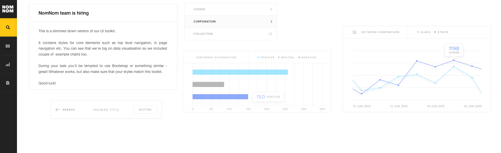

# NomNom Frontend Developer Coding Challenge

Thank you for your interest in NomNom. We don't like puzzles and
tricky questions, so we based all tasks on real-life problems
we had to solve when building NomNom.

## General rules

Only hard requirement is that you have to use ES6, SCSS or CSS, React and Redux.
Utility libraries are fine (e.g. lodash, ramda or Immutable.js) but please don't use
any other libraries or frameworks. We want to see **your** code!

Sorry, no Ember, Angular or Prototype.js+Script.aculo.us.

Once your solution is complete, please make sure to:

- use the attached API in your solution
- ensure that your code works with case-sensitive file systems
- document how to get everything running, bonus points if you're using Docker
- zip the whole project directory, including `.git`, we're curious about your
  commit history
- email it to us

If you have doubts or something is not clear - do not hesitate to ask!


## Search engine API

You will base the challenge on the API provided. To start it, run:

```
./start-api.sh
```

The only dependency is Docker, you can get it from https://www.docker.com/community-edition#/download

The API is available via `localhost` on port `8088`. Cross Origin Resource Sharing is
enabled and the API will be reachable from any browser context.

## The API

### `POST /_store`

Store given recipe, recipe has to have the following attributes:

- content - the text content
- title - title of the recipe
- id - **optional** used when upserting

Returns an object with status field and id of the recipe. Note: recipes can
be upserted, meaning that if a request with the same id is made the content will
be updated.

Example:

```
curl -X POST  localhost:8088/_store \
     -H 'Content-type: application/json' \
     -H 'Accept: application/json' \
     -d '{ "content" : "I really like bananas", "title" : "bananas" }'

# => { "status" : "ack", "id" : "abc" }
```

### `POST /_find`

Returns stored recipes. When an `id` is passed - fetches recipe with given ID.
Accepts a `query` key, which can find recipes by doing a regex match on the title and content .

**Note**: `query` has to be a valid regex string!

Example, find by ID:

```
curl -X POST localhost:8088/_find  \
     -H 'Content-type: application/json' \
     -H 'Accept: application/json' \
     -d '{ "id" : "abc" }'
# => [{ "content" : "I really like bananas",
       "title" : "bananas",
       "id" : "abc",
       "created_at" : "2018-05-21T12:33Z" }]
```

Example, find all:

```
curl -X POST localhost:8088/_find  \
     -H 'Content-type: application/json' \
     -H 'Accept: application/json' \
     -d '{}'
# => [{ "content" : "pineapples\nare cool too",
       "title" : "pineapples",
       "id" : "def",
       "created_at" : "2018-05-22T12:33Z" },
      { "content" : "I really like bananas",
       "title" : "bananas",
       "id" : "abc",
       "created_at" : "2018-05-21T12:33Z" }]
```

Example, find by query:

```
curl -X POST localhost:8088/_find  \
     -H 'Content-type: application/json' \
     -H 'Accept: application/json' \
     -d '{"query" : "bana.+"}'
# => [{ "content" : "I really like bananas",
       "title" : "bananas",
       "id" : "abc",
       "created_at" : "2018-05-21T12:33Z" }]
```


### `POST /_delete`

Deletes recipe from the index.

```
curl -X POST localhost:8088/_delete  \
     -H 'Content-type: application/json' \
     -H 'Accept: application/json' \
     -d '{ "id" : "abc" }'
# => { "status" : "ack" }
```

## The Frontend

We have prepared a basic FE boilerplate, so feel free to use/modify it and implement on top of it.
After `npm install` just run `npm start` to run the app. You can access WebPack's dev server at

http://localhost:8080

## Simple recipe app

Implement a simple recipe store web application. Users
should be able to:


- list all recipes
- search through recipes
- show single recipe
- create/read/update/delete recipes

### Optional task

**Optionally** you can show-off your CSS skills.
Please follow the attached UI example to use as a blueprint for the UI elements'
look and feel - we want to make sure that users have a great experience after all!



---

Good luck!
